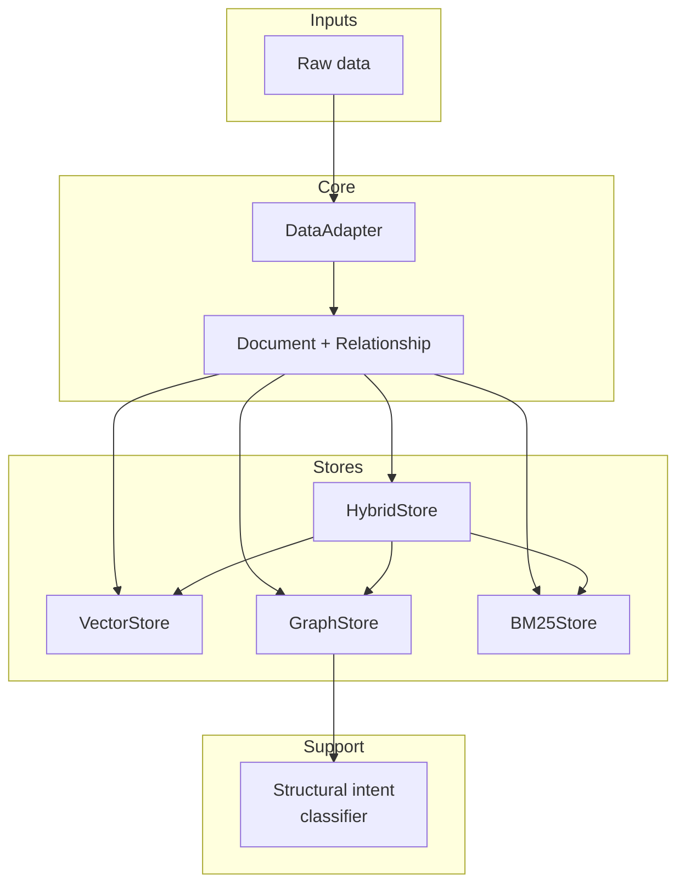

# Polyester Architecture

Polyester is a **polystore retrieval system**: multiple retrieval backends share a single document model and a common interface. Raw data is adapted into documents, then indexed and queried through pluggable stores.

## High-level flow

```
Raw data  →  Adapter  →  Documents  →  Store(s)  →  Query  →  Ranked Documents
```

## Component diagram



## Core Data Model

**Document** - Single unit of retrievable content. All stores consume the same shape. Vector store adds embeddings at index time.

**Relationship** - Directed link between two documents. Used only by the graph store.

## Adapters

**DataAdapter** - Abstract base class that provides the `load_documents` interface for derived classes. Ensures that stores ingest data in a consistent shape.

**PythonDocsAdapter** - Reads the Python stdlib-docs from a JSON file and produces documents with relationships.

## Stores

**MemoryStore** - Abstract base class that provides the `index`, `query`, `clear`, and `size` interface for store implementations. Ensures a consistent retrieval API across all backends.

**VectorStore** - ChromaDB Embeddings and cosine similarity. Best for semantic or conceptual queries.

**GraphStore** - NetworkX graph plus keyword index. Best for structural queries (e.g. "what does X call?", inheritance).

**BM25Store** - BM25 over text. Best for strong keyword overlap.

**HybridStore** - Weighted Reciprocal Rank Fusion (RRF) over vector, graph, and BM25 results. Best for general or mixed queries.

## Classifiers

**StructuralIntentClassifier** - small classifier that evaluates if a query contains structural language. Used by GraphStore to determine when to use graph expansion and what type of edges should be used.
