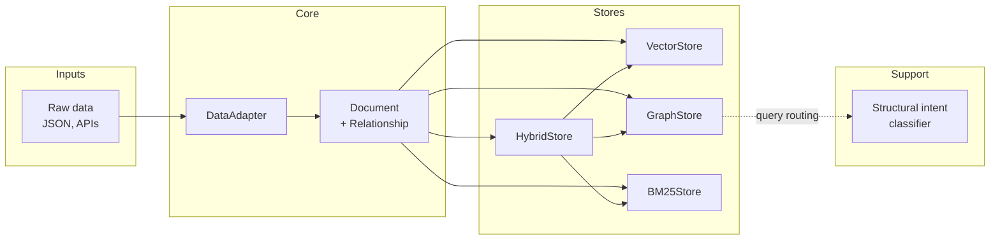

# Polyester Architecture

Polyester is a **polystore retrieval system**: multiple retrieval backends share a single document model and a common interface. Raw data is adapted into documents, then indexed and queried through pluggable stores.

## High-level flow

```
Raw data  →  Adapter  →  Documents  →  Store(s)  →  Query  →  Ranked Documents
```

## Component diagram



## Core Data Model

**Document** - Single unit of retrievable content. All stores consume the same shape. Vector store adds embeddings at index time.

**Relationship** - Directed link between two documents. Used only by the graph store.

## Adapters

**DataAdapter** - Abstract base class that provides the `load_documents` interface for derived classes. Ensures that stores ingest data in a consistent shape.

**PythonDocsAdapter** - Reads the Python stdlib-docs from a JSON file and produces documents with relationships.

## Stores

All stores implement **MemoryStore**.

| Store           | Strategy                    | Best for                         |
| --------------- | --------------------------- | -------------------------------- |
| **VectorStore** | Embeddings + cosine         | Semantic / conceptual similarity |
| **GraphStore**  | NetworkX + keywords         | "What does X call?" / structure  |
| **BM25Store**   | BM25 over text              | Strong keyword overlap           |
| **HybridStore** | Weighted RRF over all three | General / mixed queries          |

## Classifiers

**Structural intent** - small classifier (baked-in examples, LogisticRegression) that maps a query to `(is_structural, edge_type, use_successors)`. Used by GraphStore to decide whether to do graph expansion and which edge type/direction. If sklearn is missing, the graph store falls back to keyword-based pattern matching.
